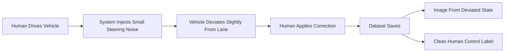

# Robustez en Conducción Autónoma  
## Comparación: Dataset Burbuja vs Noise Injection

---

## Contexto

Este estudio evalúa el impacto de incorporar **Noise Injection** en el dataset de entrenamiento de un modelo end-to-end de conducción autónoma en CARLA.

Se analiza:

- Comportamiento nominal  
- Capacidad de recuperación  
- Robustez fuera de distribución  
- Estabilidad dinámica a diferentes velocidades  

---

## Datasets usados

### Dataset Burbuja
- Conducción humana natural (sin perturbaciones artificiales)  
- Representa la política nominal estable  
- Tamaño aproximado: **50k muestras**

### Dataset Noise Injection
- Perturbaciones controladas para forzar recuperación (heading/lateral)  
- Busca expandir la región de estabilidad del controlador aprendido  
- Tamaño aproximado: **12.5k muestras**





### Dataset final de entrenamiento
```
Burbuja: 50k
Noise:   12.5k
Total:   62.5k
```

Objetivo: mantener la distribución nominal dominante, añadiendo soporte fuera de distribución.

---

## Modelo entrenado

- Arquitectura: **PilotNet (variante 2 outputs)**
- Entrada: imagen segmentada → RGB-like (3 canales)
- Salidas: **steer**, **throttle**
- Loss: **MSE**
- Framework: **PyTorch**
- Entorno: **CARLA Town02**

---

#  Resultados

---

# CASO CANÓNICO

## Comparación directa

| Métrica | Burbuja | Noise | Mejor |
|---|---:|---:|---|
| Completed distance | 755.75 | **759.23** | Noise |
| Effective distance | **466.08** | 454.25 | Burbuja |
| Average speed | 61.56 | **62.77** | Noise |
| Position deviation mean | **0.737** | 0.781 | Burbuja |
| Position deviation / km | **1.585** | 1.723 | Burbuja |
| Lane invasions / km | **3029** | 3107 | Burbuja |
| Suddenness control | **0.0305** | 0.0334 | Burbuja |
| Collisions | 0 | 0 | Empate |

### Interpretación breve
- **Noise** mejora progreso bruto y velocidad (política más reactiva).  
- **Burbuja** mantiene mejor control lateral fino, eficiencia geométrica y suavidad.

---

# CASOS PERTURBADOS (resumen)

- **Caso 1 (Recovery inicial):** Noise mejora recuperación temprana (effective distance, speed, dev/km).  
- **Caso 2 (Perturbación moderada):** Noise mantiene desempeño nominal sin degradación clara.  
- **Caso 3 (Dentro del basin):** Noise mejora eficiencia (effective) manteniendo estabilidad comparable.  
- **Caso 4 (Borde región nominal):** Noise gana en persistencia/progreso; Burbuja en precisión lateral.  
- **Caso 5 (OOD fuerte):** Noise domina en supervivencia y progreso, con tradeoff de suavidad.

---

## Tabla global (casos 1–5)

| Caso | Modelo | Completed | Effective | Speed | Dev Mean | Dev/km | Lane/km | Sudden Ctrl |
|---|---|---:|---:|---:|---:|---:|---:|---:|
| **Caso 1** | Burbuja | 741.4 | 315.4 | 60.7 | 0.99 | 3.13 | 4161 | **0.033** |
|  | Noise | **745.2** | **338.3** | **62.8** | **0.97** | **2.87** | **3943** | 0.035 |
| **Caso 2** | Burbuja | 756.8 | 554.7 | 61.7 | **0.52** | **0.94** | **2422** | **0.033** |
|  | Noise | **760.8** | ≈555.4 | **62.3** | 0.58 | 1.05 | 2445 | 0.035 |
| **Caso 3** | Burbuja | 741.7 | 561.3 | 60.4 | **0.50** | **0.89** | 2387 | **0.032** |
|  | Noise | **745.7** | **592.6** | **62.9** | 0.53 | ≈0.89 | **2332** | 0.034 |
| **Caso 4** | Burbuja | 756.7 | 544.2 | 60.3 | **0.53** | **0.97** | **2453** | **0.033** |
|  | Noise | **761.6** | **570.6** | **60.7** | 0.58 | 1.02 | ≈2466 | 0.035 |
| **Caso 5** | Burbuja | 757.3 | 301.1 | 60.2 | **1.01** | 3.36 | 4418 | **0.034** |
|  | Noise | **761.0** | **315.8** | **62.1** | ≈1.02 | **3.22** | **4333** | 0.036 |

---

# Resultados por velocidad

## 30 km/h

| Métrica | Burbuja avg | Noise (esta prueba) | Mejor |
|---|---:|---:|---|
| Completed distance | 756.07 | **760.50** | Noise |
| Effective distance | **443.17** | 416.50 | Burbuja |
| Average speed | 62.79 | **64.15** | Noise |
| Dev mean | **0.716** | 0.768 | Burbuja |
| Dev/km | **1.62** | 1.84 | Burbuja |
| Lane invasions/km | **2923** | 2996 | Burbuja |
| Suddenness control | **0.0318** | 0.0355 | Burbuja |

Interpretación: Burbuja domina el control fino; Noise aumenta avance/velocidad con más reactividad.

---

## 50 km/h

| Métrica | Burbuja | Noise | Mejor |
|---|---:|---:|---|
| Completed distance | 756.12 | **759.87** | Noise |
| Effective distance | 437.33 | **444.17** | Noise |
| Average speed | 63.85 | **64.90** | Noise |
| Dev mean | **0.695** | 0.726 | Burbuja |
| Dev/km | **1.589** | 1.639 | Burbuja |
| Lane invasions/km | 2873 | **2853** | Noise (leve) |
| Suddenness control | **0.0324** | 0.0350 | Burbuja |

Interpretación: en régimen dinámico medio, Noise ya domina progreso/velocidad; Burbuja conserva fine tracking y suavidad.

---

## 80 km/h

| Métrica | Burbuja | Noise | Mejor |
|---|---:|---:|---|
| Completed distance | 419.16 | **761.70** | Noise |
| Effective distance | 252.83 | **479.83** | Noise |
| Average speed | 25.84 | **68.20** | Noise |
| Dev mean | 1.923 | **0.659** | Noise |
| Dev/km | 7.75 | **1.37** | Noise |
| Lane invasions/km | 11028 | **2598** | Noise |
| Suddenness control | 0.0539 | **0.0349** | Noise |

Interpretación: cambio de régimen completo — Burbuja pierde estabilidad; Noise mantiene control estable.

---

## 100 km/h

| Métrica | Burbuja | Noise | Mejor |
|---|---:|---:|---|
| Completed distance | 758.98 | **762.49** | Noise |
| Effective distance | 457.67 | **475.50** | Noise |
| Average speed | 68.44 | **69.50** | Noise |
| Dev mean | **0.608** | 0.623 | Burbuja |
| Dev/km | 1.33 | **1.32** | ≈ Empate |
| Lane invasions/km | 2576 | **2478** | Noise |
| Suddenness control | **0.0331** | 0.0351 | Burbuja |

Lectura rápida: Noise gana en robustez/progreso; Burbuja conserva precisión fina y suavidad.

---

# Conclusión 

El entrenamiento con perturbaciones controladas (Noise/Recovery) no solo mejora escenarios de recuperación: **modifica el régimen dinámico** del controlador aprendido.

- **Burbuja** optimiza precisión nominal, suavidad y control lateral fino.  
- **Noise Injection** amplía la región operativa y mantiene estabilidad en regímenes exigentes (≥ 80 km/h), evitando degradación catastrófica.
